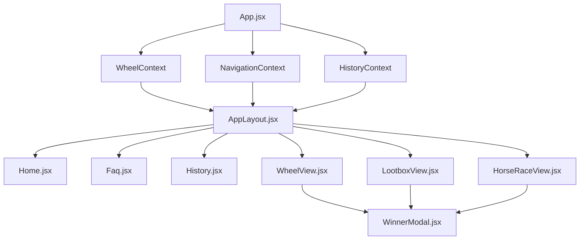
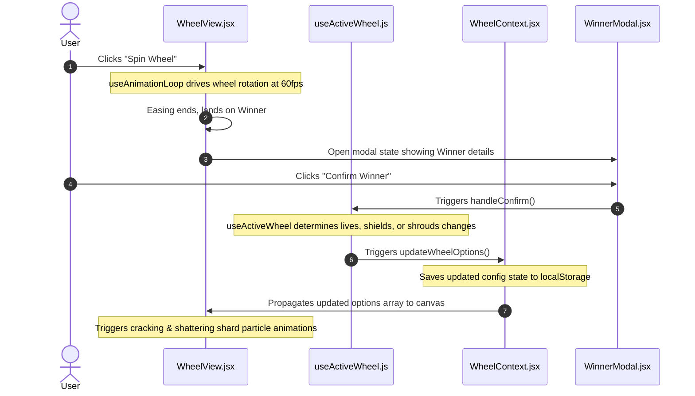

# KobSpin Code Architecture

This document outlines the modern, decoupled React architecture of KobSpin, explaining component relationships, design patterns, rendering systems, and data flows.

---

## 📂 Directory Layout

```
wheelspin-app/
├── docs/
│   └── architecture.md        # Architectural documentation (this file)
├── public/                    # Static asset directory (e.g. sounds, manifest)
├── src/
│   ├── assets/                # App-wide media, icons, and logos
│   ├── audio/                 # Modular sound effect engine
│   │   ├── audioContext.js    # Decoupled web audio context helper
│   │   ├── uiAudio.js         # Sound effects for UI interactions
│   │   ├── wheelAudio.js      # Wheel ticking sound effects
│   │   ├── lootboxAudio.js    # Lootbox case tick sound effects
│   │   ├── raceAudio.js       # Horse racing sounds (gallops, bells)
│   │   └── index.js           # Consolidated audio playback facade
│   ├── components/            # UI components (Presentation layer)
│   │   ├── ui/                # Glassmorphic and form UI primitives
│   │   ├── AppLayout.jsx      # Main layout orchestrator
│   │   ├── Home.jsx           # Dashboard and wheel selector
│   │   ├── Faq.jsx            # FAQ section page
│   │   ├── History.jsx        # Spin history logs view
│   │   ├── OnboardingModal.jsx# Onboarding tour modal
│   │   ├── SettingsModal.jsx  # Configuration settings overlay
│   │   ├── WinnerModal.jsx    # Winner announcement dialog
│   │   ├── WheelView.jsx      # Specialized view for classic wheel
│   │   ├── LootboxView.jsx    # Specialized view for CS:GO lootbox
│   │   └── HorseRaceView.jsx  # Specialized view for horse race
│   ├── context/               # Global states (State Management layer)
│   │   ├── WheelContext.jsx   # Wheels configurations CRUD & persistence
│   │   ├── NavigationContext.jsx # App navigation and modal states
│   │   └── HistoryContext.jsx # Spin history log data
│   ├── hooks/                 # Scoped custom hooks (Logic layer)
│   │   ├── useWheels.js       # CRUD operations wrapper
│   │   ├── useActiveWheel.js  # Active wheel play logic, decrements & unlocks
│   │   ├── useAnimationLoop.js# requestAnimationFrame game loop helper
│   │   ├── useNavigation.js   # Navigation hooks wrapper
│   │   └── useHistory.js      # Spin history hooks wrapper
│   ├── renderers/             # Decoupled Canvas Graphics (Draw layer)
│   │   ├── wheelRenderer.js   # Classic wheel canvas painting
│   │   ├── lootboxRenderer.js # Conveyor ticker case opening graphics
│   │   ├── horseRaceRenderer.js # Racer tracks and start lines
│   │   ├── horseRenderer.js   # Arched majestic vector horse renderer
│   │   └── particleRenderer.js # Shatter shards, sparks, confetti
│   ├── utils/                 # Modular utility scripts
│   │   ├── sanitization.js    # Data healing & backfilling for legacy schemas
│   │   ├── math.js            # Geometric & random calculations
│   │   ├── colors.js          # Color generators and HSL schemes
│   │   ├── defaultWheels.js   # Factory presets configuration builder
│   │   └── animation.js       # Easing curve functions
│   ├── App.jsx                # App shell context wrapper
│   ├── index.css              # Custom styling variables, design system tokens
│   └── main.jsx               # React DOM bootstrapper
```

---

## 🏛️ Component Hierarchy & Contexts

KobSpin separates application state from visual components. View routing and wheel configuration states are distributed using React Context providers wrapped in `App.jsx`:



### 1. State Management Layer (Contexts)
* **`WheelContext`**: Handles operations to create, edit, or delete custom configurations, and saves/loads state dynamically from `localStorage`.
* **`NavigationContext`**: Controls the active view route (`home`, `faq`, `history`, `wheel`), onboarding tour steps, and triggers transition overlays (like screen-wide flame animations).
* **`HistoryContext`**: Manages the persistent log list of previous spin winners and nested runs.

### 2. Scoped Logic Layer (Hooks)
* **`useWheels`**: Custom hook encapsulating creation and removal operations for configurations.
* **`useActiveWheel`**: Coordinates option state modifications. When a spin lands on a choice, this hook reduces remaining heart lives, triggers glass shields cracks, parses mystery shrouds, or replaces depleted options with sub-options.
* **`useAnimationLoop`**: Manages low-level `requestAnimationFrame` lifecycles. It safely registers draw loops, triggers ticker sounds, and updates frame time changes while preventing React state synchronization lags.

### 3. Display View Components
* **`WheelView`**: Integrates classic spinner canvas events.
* **`LootboxView`**: Tickers options horizontally, replicating a CS:GO case opening.
* **`HorseRaceView`**: Sprints options side-by-side on turf track lanes using relative random speeds.

---

## 🎨 Decoupled Canvas Graphic Renderers

To avoid React re-rendering bottlenecks at 60fps, all visual updates occur inside an HTML5 `<canvas>` managed by pure functional renderers in the `src/renderers/` directory:

1. **`wheelRenderer`**: Calculates radian slices, pointer offsets, peg coordinates, and wedge bounds.
2. **`lootboxRenderer`**: Renders ticker cards, spacing, indicators, and border highlights.
3. **`horseRaceRenderer`**: Draws dirt racetracks, start fences, finish line flags, and runner lanes.
4. **`horseRenderer`**: Computes vector shapes for majestic horses, adjusting knee joints, hooves, tail swings, and jockey heights.
5. **`particleRenderer`**: Handles confetti drops, spark drops, slice cracking patterns, floating unlock badge texts, and collapsing wedge shatter effects.

---

## ⚡ Data Flow Example (Winner & Depletion)



---

## 🩹 Data Sanitization & Legacy Migration
The project includes a robust validation mechanism in `src/utils/sanitization.js` that intercepts legacy config imports or obsolete `localStorage` configurations. It automatically backfills missing properties (such as shields, shrouds, and option links) with default values, ensuring older versions do not crash the React context or canvas renderers.
