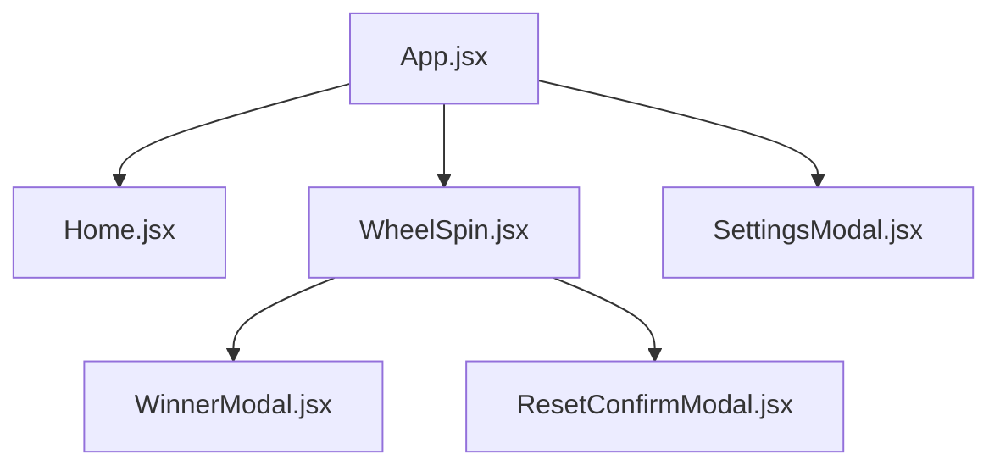
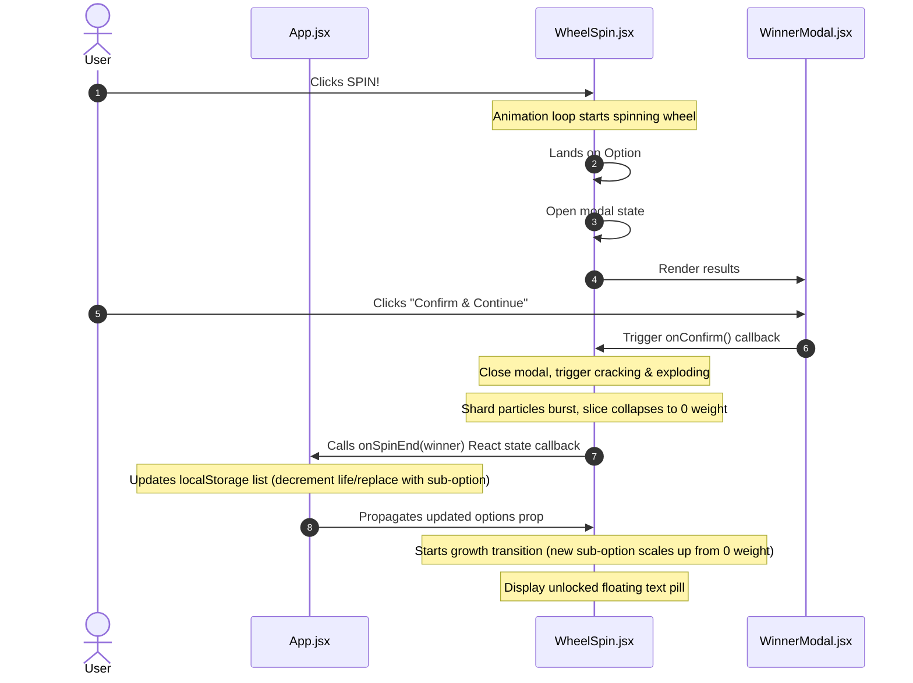

# KobSpin Code Architecture

This document outlines the design patterns, component relationships, data flows, and canvas animation systems of the KobSpin application.

---

## 📂 Directory Layout

```
wheelspin-app/
├── docs/
│   └── architecture.md        # Architectural documentation (this file)
├── public/                    # Static asset directory (e.g. sounds, manifest)
├── src/
│   ├── assets/                # App-wide media, icons, and logos
│   ├── components/            # UI components
│   │   ├── Home.jsx           # Main starting view and wheel listing
│   │   ├── ResetConfirmModal.jsx # Wheel reset confirmation overlay
│   │   ├── SettingsModal.jsx  # Configuration overlay (life bounds, names, sub-options)
│   │   ├── WheelSpin.jsx      # High-performance HTML5 Canvas wheel renderer
│   │   └── WinnerModal.jsx    # Landed option announcement dialog
│   ├── utils/
│   │   └── wheelAnimationUtils.js # Core mathematical easing and crack/shard physics formulas
│   ├── App.css                # Global layouts, badges, panels, animations
│   ├── App.jsx                # Main orchestrator component, view router, localStorage syncing
│   ├── audio.js               # Sound effect player engine
│   ├── index.css              # Custom styling variables, design system tokens
│   ├── main.jsx               # React virtual DOM bootstrap mount
│   └── utils.js               # Visual color helpers
├── index.html                 # Main template structure
├── package.json               # Dependencies and scripts
└── vite.config.js             # Bundler configs
```

---

## 🏛️ Component Hierarchy & Routing

The layout routes views dynamically via internal component state in [App.jsx](file:///C:/Users/Ronan/.gemini/antigravity/scratch/wheelspin-app/src/App.jsx):



### 1. Main Orchestrator (`App.jsx`)
* Manages global React states, including configuration list of all custom wheels (`wheels`), active wheel selection (`activeWheelId`), and view state (`home` vs `wheel`).
* Automatically initializes fallback presets if local storage database is blank.
* Listens for changes to `wheels` and persists updates to standard `localStorage`.
* Implements `handleSpinEnd()` to handle option lives decreases, substituting sub-options, and complete slice removals.

### 2. Home Dashboard (`Home.jsx`)
* Renders the landing screen listing available wheels.
* Provides triggers to select, delete, or create new wheels.

### 3. Settings Configuration Panel (`SettingsModal.jsx`)
* Allows customization of name, rotation time, option weights, colors, and max life bounds (1-10 or permanent unlimited mode).
* Supports adding nested sub-option configurations to build cascading replacement chains.

### 4. Wheel Engine (`WheelSpin.jsx`)
* Contains the game loop using an HTML5 Canvas context.
* Interacts with math utilities in `wheelAnimationUtils.js` for easing curves and procedural vector pathing.
* Displays celebration badge alerts (`WinnerModal`) and safety confirmation popups (`ResetConfirmModal`).

---

## ⚡ Data Flow



---

## 🎡 Canvas Physics & Animation Loop

To ensure smooth 60fps animations without React re-render lag, all active physical vectors (angles, velocity, particle arrays, current frame timestamps) are kept out of React state using React `useRef` tokens.

### The `animate()` Loop
A centralized `requestAnimationFrame` loop handles multiple simultaneous states:
1. **Spinning Phase**: Adjusts current angle according to a cubic ease-out calculation over the duration. Triggers click sound effects and pointer wiggles on wedge crossings.
2. **Cracking Phase**: Shakes the wedge vector position and procedurally grows crack paths along the wedge's coordinates.
3. **Explosion Phase**: Scales down the wedge's weight smoothly to 0 while throwing dozens of rotating polygon shard vectors outward.
4. **Growth Phase**: Takes the newly inserted option weight (if a sub-option was unlocked) and scales it up from `0` to its full size over 1000ms.
5. **Floating Banner Pill**: Animates the scale and upward translation of the glassmorphic achievement badge.
6. **Confetti & Golden Spark Particles**: Updates physical drag, gravity, and opacity decay of visual assets.
